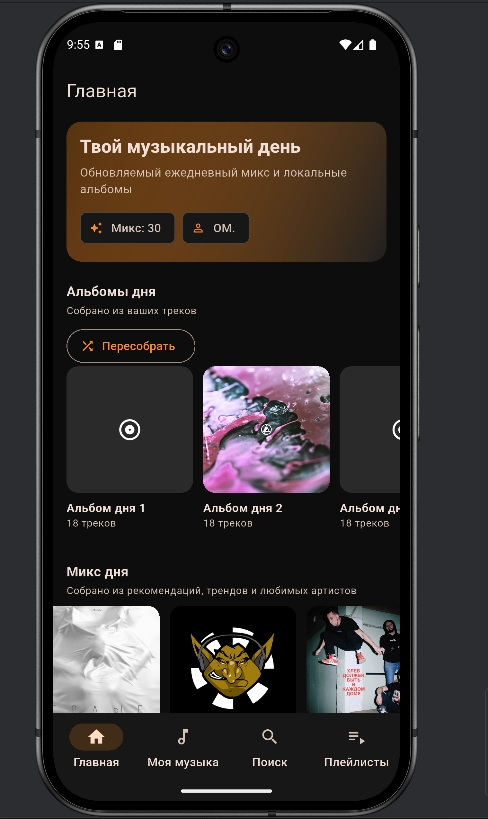
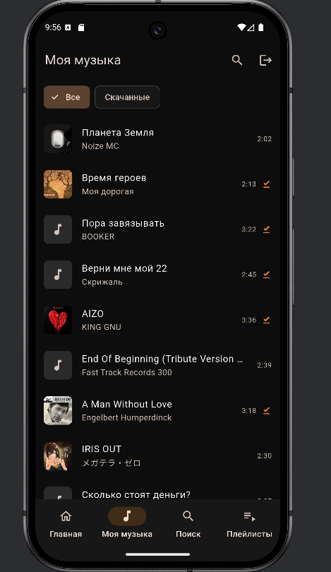
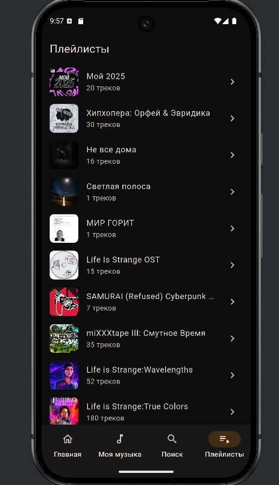

# MusicBay

MusicBay - мобильное приложение на Flutter для прослушивания музыки VK.

Проект сделан как персональный музыкальный плеер с:
- быстрым доступом к вашей медиатеке и плейлистам;
- лентой рекомендаций и подборок;
- офлайн-кэшем сохраненных треков;
- полноценным экраном плеера в темной теме.

## Возможности

- Авторизация через VK OAuth во встроенном WebView.
- Загрузка вашей музыки VK (`audio.get`) с пагинацией.
- Поиск треков в VK Music с догрузкой результатов при прокрутке.
- Загрузка плейлистов и просмотр треков внутри них.
- Добавление и удаление треков в вашей медиатеке VK.
- Добавление трека в выбранный плейлист VK.
- Автогенерация "микса дня" и локальных альбомов из:
  рекомендаций, новых треков и вашей медиатеки.
- Воспроизведение через `just_audio`:
  play/pause, следующий/предыдущий трек, перемотка, shuffle, repeat.
- Мини-плеер, доступный на основных экранах приложения.
- Локальное кэширование треков для офлайн-прослушивания.
- Отметка скачанных треков в "Моей музыке" и фильтр по загруженным.
- Пакетное скачивание до 100 треков из плейлиста.

## Технологии

- Flutter 3 / Dart 3
- Управление состоянием: `provider`
- Сеть: `dio`
- Воспроизведение аудио: `just_audio` + `audio_service`
- Локальное хранилище: `hive`, `hive_flutter`
- Безопасное хранение токена: `flutter_secure_storage`
- Web-авторизация: `webview_flutter`
- Загрузка и кэш изображений: `cached_network_image`

## Структура проекта

`lib/services`
- Клиент VK API, аудио-сервис, сервис кэша.

`lib/providers`
- Состояние VK-данных и состояние плеера.

`lib/screens`
- Экраны авторизации, главный экран с вкладками, плеер, детали плейлиста.

`lib/widgets`
- Переиспользуемые UI-компоненты (`TrackTile`, `MiniPlayer`, обложки).

## Быстрый старт

1. Установите Flutter SDK и Android toolchain.
2. Установите зависимости:
   ```bash
   flutter pub get
   ```
3. Запустите приложение:
   ```bash
   flutter run
   ```

## Сборка APK (Android)

Release APK:
```bash
flutter build apk --release
```

Готовый файл:
`build/app/outputs/flutter-apk/app-release.apk`

Сборка по ABI (файлы меньшего размера):
```bash
flutter build apk --release --split-per-abi
```

## Иконка приложения

Генерация launcher-иконок настроена через `flutter_launcher_icons`.

Исходная иконка:
`assets/icon/app_icon.png`

Предпросмотр:


Перегенерация иконок:
```bash
dart run flutter_launcher_icons
```

## Скриншоты интерфейса

<p align="center">
  
  
  
</p>

Пути для файлов скриншотов:
- `assets/screenshots/home_feed.png`
- `assets/screenshots/my_music.png`
- `assets/screenshots/playlists.png`

## Примечания

- Работа приложения зависит от VK API и доступных прав.
- Токен и `user_id` хранятся в `flutter_secure_storage`.
- Офлайн-кэш лежит в директории документов приложения и может быть очищен из интерфейса.
